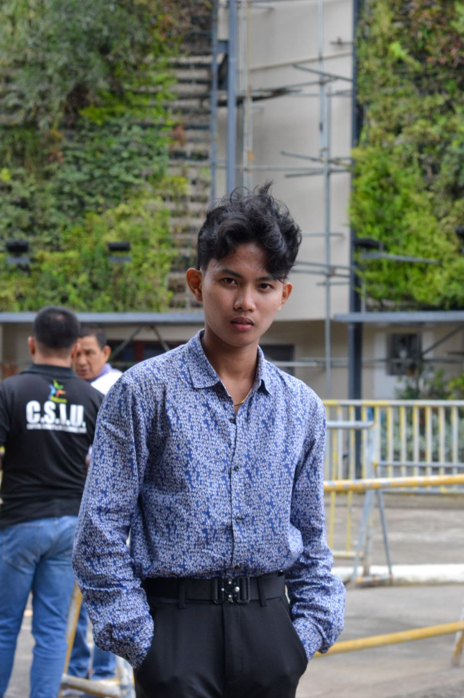

    
    <h1>John Lian R. Nerecina</h1>
    <em>Designer | Web Developer | Database Specialist</em>

## About Me

Hello! I'm **John Lian R. Nerecina**, a multidisciplinary designer and developer with expertise in creating stunning resumes, journals, books, presentations, and web designs. I also have strong experience in video editing and database design, offering a unique blend of creativity and technical skills.

I enjoy solving complex design problems and delivering high-quality, aesthetically pleasing solutions for clients and businesses alike.

## Skills

- **Design:** Resume, Journal, Book Design, Web Design (HTML, CSS, JavaScript), Presentation Design
- **Development:** Frontend Development (HTML, CSS, JavaScript), Database Design (SQL, Lucidchart)
- **Video Editing:** Capcut, Filmora, Kinemaster, Canva

## Experience

### Freelance Designer - Upwork.com
*January 2023 - Present*
- Created custom designs for resumes, journals, and book layouts.
- Designed websites for small businesses with responsive layouts and modern UI/UX standards.
- Worked closely with clients to capture their brand identity through visual designs.
- [View Profile Here](https://www.upwork.com/freelancers/~018bab50f508d422a2?mp_source=share)

### Transcriber - Consumer Republiq
*November 2023 - Present*
- Transcribed audio files for research projects, focusing on group discussions.
- Delivered accurate and high-quality transcriptions under tight deadlines.

## Education

- **BS Computer Science**, New Era University, 2023-present

## Certifications

- **SQL and Relational Databases 101**
  - **Provider:** Cognitive Class
  - **Issued:** October 23, 2024
  - **Certification ID:** a6edc39e5d2f45b3aa3892fcd4452ce1
  - [View Certificate](https://courses.cognitiveclass.ai/certificates/a6edc39e5d2f45b3aa3892fcd4452ce1)

## Projects

### AC Promax Pest Control Services - Banner Design
Designed an advertisement banner highlighting the company’s eco-friendly pest control services, utilizing eye-catching visuals and clear messaging.

### Portfolio Website
Developed a personal portfolio website to showcase design and development projects, using HTML, CSS, and JavaScript for a responsive and modern interface.

### Custom Resume Design for Clients
Crafted custom-designed resumes tailored to specific client needs, ensuring both aesthetic appeal and functional layout for job applications.

## Tools & Technologies

- **Design:** Canva, Adobe Photoshop, Figma
- **Video Editing:** Capcut, Filmora, Kinemaster
- **Development:** HTML, CSS, JavaScript, Visual Studio Code
- **Database:** SQL, Lucidchart
- **Collaboration:** Slack, Trello, GitHub

## Contact

- 📧 **Email:** [johnliannerecina@gmail.com](johnliannerecina@gmail.com)
- 🔗 **LinkedIn:** [linkedin.com/in/john-lian-nerecina-042744286](linkedin.com/in/john-lian-nerecina-042744286)
- 🌐 **Portfolio:** [yourwebsite.com](https://yourwebsite.com)
- 📞 **Contact Number:** [09055926741](09055926741)
